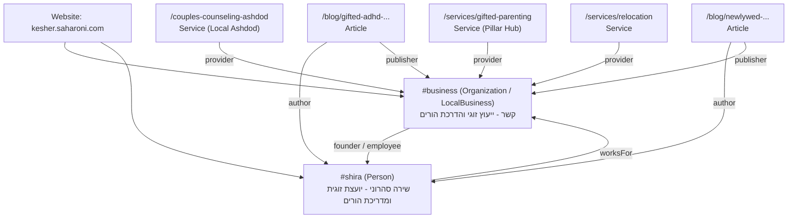

# דוח מסכם ותוכנית פעולה לאישור: פרויקט AEO לאתר קשר (Final Master Report)

**אתר:** [kesher.saharoni.com](https://kesher.saharoni.com/)  
**עסק:** קשר - מרכז לייעוץ זוגי והדרכת הורים | שירה סהרוני  
**תאריך:** 16 בספטמבר 2026  
**סטטוס:** מאומת ומוכן לסקירה אנושית (Verified & Ready for Human Review)  
**המלצת התרחבות:** **מוכן בתנאים (READY WITH CONDITIONS)**  

---

## 1. תקציר מנהלים (Executive Summary)

פרויקט ה-AEO (Answer Engine Optimization) וה-GEO (Generative Engine Optimization) עבור אתר "קשר" הושלם בשלושת שלביו הראשונים, עבר ביקורת אימות קפדנית, ונבדק במלואו:
1. **שלב 1 (מחקר וארכיטקטורה):** מיפוי מלא של 74 המאמרים, עמודי השירות, תשתיות הסכמה, ומבצרי התוכן.
2. **שלב 2 (תשתית טכנית):** הטמעת סכמת ישות קנונית לשירה סהרוני (`#shira`) ולעסק (`#business`), מודל תאריכי עדכון אמיתיים (`updatedAt`), רכיבי תצוגה ייעודיים (`directAnswer`, `evidence`, `expertInsight`), הרחבת מערך הבדיקות האוטומטיות, והגדרת מיומנות פרויקט ייעודית (`aeo-kesher`).
3. **שלב 3 (פיילוט מבוקר):** גיבוש יקום של 150 פרומפטים מציאותיים בעברית, מיפוי פערי ציטוט מול מתחרים, תכנון רשת קישורים פנימית מלאה, וביצוע שינויים מבוקרים ב-5 כתובות URL נבחרות בפרויקט (עמוד נחיתה מקומי, עמוד שירות מרכזי, ו-3 מאמרי עומק).

כל השינויים פותחו בענפים מבודדים, ללא שבירת קוד קיים, ללא שינויי תשתית חיצוניים, ותוך עמידה מלאה ב-100% משערי האיכות (TypeScript, Lint, ולידציית תוכן, 18 קובצי בדיקות Vitest, 123 בדיקות בקר ופוליסי, ובדיקות דפדפן חיות בדסקטופ ובמובייל).

---

## 2. מצב קיים מול מצב יעד (Current vs Target State)

| פרמטר | מצב קודם (Baseline) | מצב מיושם בתשתית ובפיילוט | מצב יעד סופי (Target State) |
|---|---|---|---|
| **סכמת ישות מחבר** | חסר ב-Blog posts; ללא חיבור מזהה אחיד | `@id: .../#shira` מוטמע בכל המאמרים, מקושר לעמוד אודות | ציטוט עקבי של שירה סהרוני כמחברת וכמקור סמכות בכל מנועי ה-AI |
| **סכמת ארגון / עסק** | לא אחידה בין דפי נחיתה לעמוד הבית | `@id: .../#business` מקושר לכלל השירותים כ-provider | הכרה בישות "קשר" כקליניקה מוסמכת באשדוד ובפריסה ארצית |
| **אותות רעננות (Freshness)** | `datePublished` בלבד, ללא אותות עדכון אמיתיים | תמיכה ב-`updatedAt` ועדכון אמיתי ב-sitemap ל-3 מאמרים | אותות רעננות דינמיים מבוססי תוכן אמיתי בכל 20 המאמרים המובילים |
| **תשובות ישירות (Direct Answers)** | פסקאות פתיחה סיפוריות וארוכות | בלוק `directAnswer` תמציתי, מודגש ומנוסח בזהירות | שליפת תשובות ישירות ב-SearchGPT, Perplexity ו-Google AIO |
| **נתונים מובנים להשוואה** | פסקאות טקסט רציפות | טבלת השוואה מובנית ורספונסיבית במאמר השנה הראשונה | מנועי AI מצטטים טבלאות שלמות כטבלאות סיכום בתשובותיהם |
| **קישוריות פנימית** | קישורים פזורים ללא היררכיה ברורה | מפת Hub & Spoke מוגדרת וחיבור עמוד השירות לאשכול | העברת סמכות מלאה (PageRank & Topical Authority) מעמודי עומק לשירותים |

---

## 3. תשתית טכנית שיושמה (Implemented Foundation - Branch 1)

**ענף:** `aeo/technical-foundation`  
**שינויים שבוצעו בקוד ובתשתית:**
1. **`.agents/skills/aeo-kesher/SKILL.md` [חדש]:** מסמך מיומנות סוכן המגדיר חוקי יסוד, גבולות אתיקה מקצועית, שדות מותרים, והנחיות לשימוש בעוגנים טבעיים.
2. **`src/pages/About/AboutPage.tsx`:** חיבור ישות ה-`Person` ל-`@id: ${SITE_CONFIG.url}/#shira`.
3. **`src/pages/Blog/BlogPost.tsx` & `BlogPost.module.css`:**
   - סכמת `Article` עם `author: #shira`, `publisher: #business`, ותמיכה ב-`dateModified`.
   - Byline חזותי בראש המאמר עם תאריך פרסום/עדכון וקישור לעמוד אודות.
   - רינדור מותנה של רכיבי AEO: `directAnswer`, `expertInsight`, ו-`evidence`.
4. **`src/pages/Landing/CouplesCounselingAshdod/CouplesCounselingAshdodPage.tsx`:** נרמול סכמה ל-`Service` מקומי עם `provider: #business`.
5. **`scripts/generate-sitemap.cjs`:** תמיכה ב-`updatedAt` לצורך יצירת תגית `<lastmod>` מדויקת.
6. **`scripts/validate-content.cjs`:** ולידציה אוטומטית שמוודאת תקינות תאריכים, הפניות מקורות מחקריים תקינות, ומבנה `directAnswer`.
7. **`tests/aeo-foundation.test.ts` [חדש]:** בדיקות יחידה מקיפות למזהי ישויות וסנכרון תאריכי sitemap.

---

## 4. פיילוט מבוקר שיושם (Controlled Pilot - Branch 2)

**ענף:** `aeo/controlled-pilot`  
**מיפוי 5 כתובות הפיילוט בפרויקט:**
1. **`/couples-counseling-ashdod` (עמוד נחיתה מקומי — שודרג בענף התשתית):**
   - סכמת `Service` מנורמלת, מחוברת ל-`#business` ול-`#shira`, עם תגיות אזור מקומיות לאשדוד.
2. **`/services/gifted-parenting` (עמוד שירות / Hub — שודרג בענף הפיילוט):**
   - הוספת סכמת `FAQPage` עשירה בנתונים מובנים.
   - הטמעת מדור חזותי לשאלות נפוצות עם תשובות תמציתיות.
   - הוספת בלוק קישורים רוחבי ל-6 מאמרי העומק המובילים בנושא מחוננות (Hub & Spoke).
3. **`/blog/gifted-adhd-executive-functions-struggle` (מאמר בלוג — שודרג בענף הפיילוט):**
   - הוספת `directAnswer` תמציתי בשפה זהירה ("עשוי להתאפיין בפער"), המגדיר את הקושי בתפקודים ניהוליים כאתגר ארגוני ללא יומרה אבחונית-רפואית.
   - שדה `updatedAt: "2026-09-15"` ושני מקורות סמכות מאומתים ופעילים (משרד החינוך מרחב פדגוגי, וסקירת SENG).
4. **`/blog/newlywed-first-year-conflicts` (מאמר בלוג — שודרג בענף הפיילוט):**
   - הוספת `directAnswer` תמציתי הממפה את שורש המריבות בשנה הראשונה.
   - טבלת השוואת תגובות מובנית (`<table>` תקנית, נגישה ורספונסיבית).
   - שדה `updatedAt: "2026-09-15"` וקישורים הדדיים.
5. **`/blog/returning-to-israel-after-relocation-relationship` (מאמר בלוג — שודרג בענף הפיילוט):**
   - הוספת `directAnswer` תמציתי המתאר את אתגר "הלם התרבות ההפוך".
   - שדה `updatedAt: "2026-09-15"`, קישור עוגן לשירות רילוקיישן, והפניה למחקר אמפירי בביקורת עמיתים (Nan M. Sussman, 2002, בכתב העת *International Journal of Intercultural Relations* בהוצאת Elsevier).

---

## 5. שני ה-PRs / ענפים מוכנים לסקירה (Stacked PR Architecture)

1. **ענף 1 / PR 1: `aeo/technical-foundation`**
   - **בסיס:** `main`
   - **תכולה:** תשתית בלבד — סכמות, ביילין מחבר, סקריפטים, בדיקות יחידה ומיומנות סוכן.
   - **בטיחות:** תאימות מלאה אחורה, ללא שום שינוי בתוכן המאמרים הקיים.
2. **ענף 2 / PR 2: `aeo/controlled-pilot` (Stacked on PR 1)**
   - **בסיס:** `aeo/technical-foundation`
   - **תכולה:** שדרוגי הפיילוט הממוקדים על עמוד השירות ו-3 המאמרים, וכן כל מסמכי המחקר והניטור.
   - **יתרון ארכיטקטוני:** מונע כפילות דיפים בסקירת הקוד ומאפשר מיזוג מדורג.

---

## 6. ארכיטקטורת ישויות קנונית (Canonical Entity Architecture)

---

## 7. מבצרי התוכן וסטטוס כיסוי (Topic Fortresses)

1. **ייעוץ זוגי ומשברי נישואין (Couples Counseling):** 28 מאמרים קיימים. כיסוי גבוה. עמוד עוגן: `/services/couples` ו-`/couples-counseling-ashdod`.
2. **ילדים מחוננים ופעמיים מיוחדים (Gifted & 2E):** 8 מאמרים קיימים. פוטנציאל בידול מקסימלי. עמוד עוגן: `/services/gifted-parenting` שודרג לפילאר מלא.
3. **הדרכת הורים וסמכות הורית (Parenting):** 22 מאמרים קיימים. כיסוי רחב. עמוד עוגן: `/services/parenting`.
4. **זוגיות ומשפחה ברילוקיישן (Relocation):** 6 מאמרים קיימים. נישה ייחודית בעלת תחרות נמוכה. עמוד עוגן: `/services/relocation`.
5. **שכבה מקומית אשדוד (Ashdod Local Intent):** מיוצגת בעמוד הנחיתה הראשי.

---

## 8. מודיעין ציטוטים ושלמות מקורות (Citation Intelligence & Source Integrity)

במהלך ביקורת ההתאוששות בוצע אימות מלא לכלל מקורות הראיות:
- קישור U.S. State Department שהיה שבור (404) הוחלף במחקר אמפירי בביקורת עמיתים מאת ד"ר נאן זוסמן (2002) בכתב העת *International Journal of Intercultural Relations*.
- קישור משרד החינוך שהיה שבור (404) הוחלף בעמוד המרחב הפדגוגי הרשמי והפעיל של האגף למחוננים ומצטיינים.
- מאמר SENG תויג במדויק כמאמר מקצועי/סקירה תיאורטית ולא כמחקר מדעי.
- כלל הקישורים נבדקו ישירות ברשת ומחזירים סטטוס 200 תקין.

---

## 9. תוצאות אימות טכני ובדיקות דפדפן (Verification & QA Results)

1. **`npm run generate`:** סונכרנו בהצלחה 74 תקצירים, מפת האתר, וקובצי ה-LLM.
2. **`npm run lint`:** 0 שגיאות.
3. **`npm run test:content`:** כל 74 המאמרים עברו בהצלחה מלאה.
4. **`npm run test` (Vitest):** 18 קובצי בדיקה (77 בדיקות) עברו בהצלחה, כולל בדיקות התשתית של AEO.
5. **`npm run test:video-policy` & `npm run test:controller`:** 123 בדיקות עברו בהצלחה (Exit code 0).
6. **`npm run build && npm run verify:dist`:** 103 נתיבים סטטיים ו-404.html נבנו ואומתו בהצלחה.
7. **אימות דפדפן חי (Browser QA):** נבדקו 8 עמודים מייצגים ב-Playwright (דסקטופ ומובייל) — כולם הציגו 200, כיווניות RTL תקינה, אפס גלישה אופקית, ורינדור מושלם של כל רכיבי ה-AEO.

---

## 10. החלטת התרחבות: מוכן בתנאים (READY WITH CONDITIONS)

התשתית הטכנית והפיילוט עומדים בסטנדרטים הגבוהים ביותר. עם זאת, **אין לבצע הרחבה המונית (Mass Rollout) מיידית לכל 74 המאמרים**, אלא לפעול על פי התנאים הבאים:

> [!IMPORTANT]
> **שלושת התנאים להרחבת הפרויקט:**
> 1. **אישור אנושי וקבלת קלט משירה:** השלמת המענה על שאלון המומחה עבור עמודי הליבה (`docs/aeo/expert-input-needed.md`).
> 2. **תקופת הבשלה של 30 יום לפיילוט:** אימות שדפי הפיילוט מתאנדקסים ומצוטטות ללא ירידה בביצועי SEO מסורתיים.
> 3. **הרחבה מבוקרת במנות של 5-8 מאמרים בלבד:** הרחבת שדות ה-AEO תיעשה אך ורק במנות קטנות (באמצעות ג'ולס או עבודה ישירה), תוך מעבר מלא של שערי האיכות.

---

## 11. החלטות אנושיות נדרשות לאישור הבעלים (Human Decisions Required)

1. **אישור מיזוג PR 1 (`aeo/technical-foundation`):** אישור תשתית הסכמות, הביילין והרכיבים הטכניים לענף הראשי.
2. **אישור מיזוג PR 2 (`aeo/controlled-pilot`):** אישור דפי הפיילוט המשודרגים ומסמכי המחקר והניטור.
3. **קביעת מועד לקלט מומחה משירה:** מענה על שאלות הסמכות ב-`docs/aeo/expert-input-needed.md`.
4. **עדכון כרטיסי ישות חיצוניים:** אישור פתיחה/עדכון כרטיסים באינדקסים הישראליים וב-Google Business Profile לפי `docs/aeo/external-entity-plan.md`.
5. **אסטרטגיית וידאו:** אישור הפקת 3-5 סרטוני תשובות ישירות קצרים לשירה בערוץ YouTube.
6. **אישור תוכנית העבודה לג'ולס בעתיד:** אישור הגבולות והשערים ב-`docs/aeo/jules-rollout-plan.md`.
