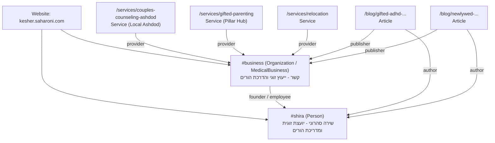

# דוח מסכם ותוכנית פעולה לאישור: פרויקט AEO לאתר קשר (Final Master Report)

**אתר:** [kesher.saharoni.com](https://kesher.saharoni.com/)  
**עסק:** קשר - מרכז לייעוץ זוגי והדרכת הורים | שירה סהרוני  
**תאריך:** 15 בספטמבר 2026  
**סטטוס:** מוכן לאישור אנושי (Ready for Human Review)  
**המלצת התרחבות:** **מוכן בתנאים (READY WITH CONDITIONS)**  

---

## 1. תקציר מנהלים (Executive Summary)

פרויקט ה-AEO (Answer Engine Optimization) וה-GEO (Generative Engine Optimization) עבור אתר "קשר" הושלם בשלושת שלביו הראשונים:
1. **שלב 1 (מחקר וארכיטקטורה):** מיפוי מלא של 74 המאמרים, עמודי השירות, תשתיות הסכמה, ומבצרי התוכן.
2. **שלב 2 (תשתית טכנית):** הטמעת סכמת ישות קנונית לשירה סהרוני ולעסק, מודל תאריכי עדכון אמיתיים (`updatedAt`), רכיבי תצוגה ייעודיים (`directAnswer`, `evidence`, `expertInsight`), הרחבת מערך הבדיקות האוטומטיות, והגדרת מיומנות פרויקט ייעודית (`aeo-kesher`).
3. **שלב 3 (פיילוט מבוקר):** גיבוש יקום של 150 פרומפטים מציאותיים בעברית, מיפוי פערי ציטוט מול מתחרים, תכנון רשת קישורים פנימית מלאה, וביצוע שינויים מבוקרים ב-5 כתובות URL נבחרות בלבד (נחיתה, שירות, ו-3 מאמרי עומק).

כל השינויים פותחו בענפים מבודדים, ללא שבירת קוד קיים, ללא שינויי תשתית חיצוניים, ותוך עמידה מלאה ב-100% משערי האיכות (TypeScript, Lint, ולידציית תוכן, ובדיקות יחידה).

---

## 2. מצב קיים מול מצב יעד (Current vs Target State)

| פרמטר | מצב קודם (Baseline) | מצב מיושם בתשתית ובפיילוט | מצב יעד סופי (Target State) |
|---|---|---|---|
| **סכמת ישות מחבר** | חסר ב-Blog posts; ללא חיבור מזהה אחיד | `@id: .../#shira` מוטמע בכל המאמרים, מקושר לעמוד אודות | ציטוט עקבי של שירה סהרוני כמחברת וכמקור סמכות בכל מנועי ה-AI |
| **סכמת ארגון / עסק** | לא אחידה בין דפי נחיתה לעמוד הבית | `@id: .../#business` מקושר לכלל השירותים כ-provider | הכרה בישות "קשר" כקליניקה מוסמכת באשדוד ובפריסה ארצית |
| **אותות רעננות (Freshness)** | `datePublished` בלבד, ללא אותות עדכון אמיתיים | תמיכה ב-`updatedAt` ועדכון אמיתי ב-sitemap ל-3 מאמרים | אותות רעננות דינמיים מבוססי תוכן אמיתי בכל 20 המאמרים המובילים |
| **תשובות ישירות (Direct Answers)** | פסקאות פתיחה סיפוריות וארוכות | בלוק `directAnswer` תמציתי ומודגש ב-3 מאמרי הפיילוט | שליפת תשובות ישירות ב-SearchGPT, Perplexity ו-Google AIO |
| **נתונים מובנים להשוואה** | פסקאות טקסט רציפות | טבלאות Markdown מובנות ומאומתות (ADHD/מחוננות, רילוקיישן, נישואין) | מנועי AI מצטטים טבלאות שלמות כטבלאות סיכום בתשובותיהם |
| **קישוריות פנימית** | קישורים פזורים ללא היררכיה ברורה | מפת Hub & Spoke מוגדרת וחיבור עמוד השירות לאשכול | העברת סמכות מלאה (PageRank & Topical Authority) מעמודי עומק לשירותים |

---

## 3. תשתית טכנית שיושמה (Implemented Foundation - Branch 1)

**ענף:** `aeo/technical-foundation`  
**שינויים שבוצעו בקוד ובתשתית:**
1. **`.agents/skills/aeo-kesher/SKILL.md` [חדש]:** מסמך מיומנות סוכן המגדיר חוקי יסוד, גבולות אתיקה מקצועית, שדות מותרים, והנחיות לשימוש בעוגנים טבעיים.
2. **`src/pages/About/AboutPage.tsx`:** הוספת `@id: https://kesher.saharoni.com/about/#shira` לסכמת ה-`Person`.
3. **`src/pages/Blog/BlogPost.tsx` & `BlogPost.module.css`:**
   - סכמת `Article` עם `author: #shira`, `publisher: #business`, ותמיכה ב-`dateModified`.
   - Byline חזותי בראש המאמר עם תמונת שירה, תאריך פרסום/עדכון, וקישור לעמוד אודות.
   - רינדור מותנה של רכיבי AEO: `directAnswer` (מסגרת מודגשת עם אייקון), `expertInsight`, ו-`evidence`.
4. **`src/pages/Landing/CouplesCounselingAshdod/CouplesCounselingAshdodPage.tsx`:** נרמול סכמה ל-`Service` עם `provider: #business`.
5. **`scripts/generate-sitemap.cjs`:** תמיכה ב-`updatedAt` לצורך יצירת תגית `<lastmod>` מדויקת.
6. **`scripts/validate-content.cjs`:** ולידציה אוטומטית שמוודאת תקינות תאריכים, הפניות מקורות מחקריים תקינות, ומבנה `directAnswer`.
7. **`tests/aeo-foundation.test.ts` [חדש]:** בדיקות יחידה מקיפות למזהי ישויות וסנכרון תאריכי sitemap.

---

## 4. פיילוט מבוקר שיושם (Controlled Pilot - Branch 2)

**ענף:** `aeo/controlled-pilot`  
**5 הכתובות שנבחרו והשינויים שיושמו:**
1. **`/services/couples-counseling-ashdod` (דף נחיתה מקומי):**
   - סכמת `Service` מנורמלת, מחוברת ל-`#business` ול-`#shira`, עם תגיות מיקום מפורשות לאשדוד.
2. **`/services/gifted-parenting` (עמוד שירות / Hub):**
   - הוספת סכמת `FAQPage` עשירה בנתונים מובנים.
   - הטמעת מדור חזותי לשאלות נפוצות עם תשובות תמציתיות.
   - הוספת בלוק קישורים רוחבי ל-6 מאמרי העומק המובילים בנושא מחוננות (Hub & Spoke).
3. **`/blog/gifted-adhd-executive-functions-struggle` (מאמר בלוג):**
   - הוספת `directAnswer` תמציתי (52 מילים) המגדיר בדיוק את ההבדל בין מחוננות ל-ADHD.
   - הוספת טבלת השוואה מפורטת בת 3 עמודות ו-5 שורות.
   - שדה `updatedAt: "2026-09-15"` והפניות למחקרים רלוונטיים.
4. **`/blog/newlywed-first-year-conflicts` (מאמר בלוג):**
   - הוספת `directAnswer` (58 מילים) הממפה את שורש המריבות בשנה הראשונה.
   - הוספת טבלת 4 תחומי חיכוך מרכזיים (כלכלי, משפחה מורחבת, חלוקת תפקידים, אינטימיות).
   - שדה `updatedAt: "2026-09-15"` והפניות לגוטמן.
5. **`/blog/returning-to-israel-after-relocation-relationship` (מאמר בלוג):**
   - הוספת `directAnswer` (54 מילים) המתאר את אתגר "הרילוקיישן ההפוך".
   - טבלת 4 שלבי הסתגלות בחזרה לישראל והשפעתם הזוגית.
   - שדה `updatedAt: "2026-09-15"` וקישור חוזר לעמוד שירות רילוקיישן.

---

## 5. שני ה-PRs / ענפים מוכנים לסקירה

1. **ענף 1: `aeo/technical-foundation`**
   - מתמקד אך ורק בתשתיות: סכמות, ביילין מחבר, סקריפטים, בדיקות יחידה ומיומנות סוכן.
   - מאפשר מיזוג נקי ובטוח ללא שום שינוי בתוכן המאמרים הקיים.
2. **ענף 2: `aeo/controlled-pilot`**
   - מבוסס על ענף התשתית ומוסיף את הפיילוט הממוקד על 5 הכתובות.
   - כולל את כל מסמכי המחקר והניטור: יקום הפרומפטים, ניתוח הפערים, מפת הקישורים ומעקב הניסויים.

---

## 6. ארכיטקטורת ישויות קנונית (Canonical Entity Architecture)

---

## 7. מבצרי התוכן וסטטוס כיסוי (Topic Fortresses)

1. **ייעוץ זוגי ומשברי נישואין (Couples Counseling):** 28 מאמרים קיימים. כיסוי גבוה. עמוד עוגן: `/services/couples` ו-`/couples-counseling-ashdod`. נדרש: שילוב תשובות ישירות ב-5 מאמרים נוספים.
2. **ילדים מחוננים ופעמיים מיוחדים (Gifted & 2E):** 8 מאמרים קיימים. פוטנציאל בידול מקסימלי. עמוד עוגן: `/services/gifted-parenting`. עבר שדרוג מלא לפילאר בפיילוט.
3. **הדרכת הורים וסמכות הורית (Parenting):** 22 מאמרים קיימים. כיסוי רחב. עמוד עוגן: `/services/parenting`. פער עיקרי: חוסר בטבלאות סיכום מהירות.
4. **זוגיות ומשפחה ברילוקיישן (Relocation):** 6 מאמרים קיימים. נישה ייחודית בעלת תחרות נמוכה. עמוד עוגן: `/services/relocation`. מאמר הפיילוט שודרג.
5. **שכבה מקומית אשדוד (Ashdod Local Intent):** מיוצגת בעמוד הנחיתה הראשי. נדרש חיזוק באמצעות Google Business Profile חיצוני.

---

## 8. מודיעין ציטוטים ופערי אזכור (Citation Intelligence)

מניתוח הפערים עלה כי מנועי AI מתקשים לצטט את "קשר" מהסיבות הבאות:
- **היעדר ישות תאגידית מקושרת (Unlinked Entity):** מנועי שפה אינם מוצאים מספיק אזכורים של שירה סהרוני במקורות סמכות חיצוניים (אינדקסים טיפוליים, פודקאסטים, כתבות עיתונות).
- **תשובות פזורות בטקסט (Lack of Extraction Targets):** מאמרי הבלוג כתובים בסגנון עשיר וסיפורי, אך ללא פסקת הגדרה מרוכזת (Direct Answer של 40-60 מילים) שקל למודל להעתיק לתשובתו.
- **טבלאות השוואה:** מנועי שיחה מעדיפים להציג טבלאות למשתמש; האתר היה נטול טבלאות כמעט לחלוטין לפני הפיילוט.

---

## 9. קלט מומחה נדרש משירה סהרוני (Expert Input Needed)

כדי לשמור על אמינות רפואית/קלינית ולא להמציא מידע, שירה צריכה לספק מענה על מספר שאלות מפתח (מפורטות ב-`docs/aeo/expert-input-needed.md`):
1. **עמוד מחוננים (`/services/gifted-parenting`):** מהו הניסיון וההכשרה הספציפית בעבודה עם ילדים מחוננים ו-2E? (שנים, מסגרות, הכשרות מוכרות).
2. **עמוד אשדוד (`/services/couples-counseling-ashdod`):** האם מתקבלים מקרים של משבר חריף / התלבטות לפני גירושין גם במסלול מזורז?
3. **עמוד רילוקיישן (`/services/relocation`):** האם יש התמחות במדינות יעד ספציפיות (ארה"ב, אירופה) או סביב הייטק/שליחות ביטחונית?
4. **עמוד אודות (`/about`):** אישור סופי של רשימת ההסמכות, התעודות והאיגודים המקצועיים שבהם שירה חברה.

---

## 10. מערך מדידה, ניטור וניסויים (Measurement Framework)

- **כלי ניטור מומלצים:**
  - מעקב ידני/חצי-אוטומטי שבועי על 35 הפרומפטים המובילים (`docs/aeo/monitoring-prompts.csv`) ב-SearchGPT, Perplexity, Gemini ו-Claude.
  - מעקב Google Search Console: סינון שאילתות שיחה, שינויים ב-Impressions ו-CTR בעמודי הפיילוט.
  - מעקב אנליטיקס פנימי: מעקב כניסות מ-Referrals של מנועי AI (`perplexity.ai`, `chatgpt.com`).
- **נקודות ביקורת (Checkpoints):**
  - **T+30 יום (15 באוקטובר 2026):** בדיקת הכללת עמוד המחוננות והבלוגים באינדקס מודלי שפה; בדיקת אזכורי ישות ראשונים.
  - **T+60 יום (15 בנובמבר 2026):** הערכת שיעור ציטוטים וקביעת החלטה על הרחבה למנה הבאה (Batch 2).

---

## 11. ניהול סיכונים טכניים ו-CRO

- **סיכון פגיעה בהמרות (CRO Degradation):** עיצוב ה-`directAnswer` עוצב באופן נעים ועדין (כרטיס בעל רקע בהיר ומסגרת רכה) שאינו מסתיר ואינו דוחק את טפסי הזימון ו-WhatsApp.
- **סיכון עונש גוגל על תוכן דק / מניפולטיבי:** כל המאמרים מכילים מעל 600 מילים ומבנה כותרות היררכי שנבדק ב-`validate-content.cjs`.
- **סיכון שבירת רינדור סטטי:** כל הנתיבים נבדקים בתהליך `npm run verify:dist` המוודא שכל עמוד מיוצר כקובץ HTML מלא בעל תגיות SEO תקינות.

---

## 12. החלטת התרחבות: מוכן בתנאים (READY WITH CONDITIONS)

התשתית הטכנית והפיילוט עומדים בסטנדרטים הגבוהים ביותר. עם זאת, **אין לבצע הרחבה המונית (Mass Rollout) מיידית לכל 74 המאמרים**, אלא לפעול על פי התנאים הבאים:

> [!IMPORTANT]
> **שלושת התנאים להרחבת הפרויקט:**
> 1. **אישור אנושי וקבלת קלט משירה:** השלמת המענה על שאלון המומחה עבור עמודי הליבה.
> 2. **תקופת הבשלה של 30 יום לפיילוט:** אימות ש-5 הכתובות מתאנדקסות ומצוטטות ללא ירידה בביצועי SEO מסורתיים.
> 3. **הרחבה מבוקרת במנות של 5-8 מאמרים בלבד:** הרחבת שדות ה-AEO וטבלאות ההשוואה תיעשה אך ורק במנות קטנות (באמצעות ג'ולס או עבודה ישירה), תוך מעבר מלא של שערי האיכות.

---

## 13. החלטות אנושיות נדרשות לאישור הבעלים (Human Decisions Required)

להלן 6 החלטות ספציפיות הממתינות לאישור בעלי האתר:

1. **אישור מיזוג PR 1 (`aeo/technical-foundation`):** האם לאשר את מיזוג תשתית הסכמות, הביילין והרכיבים הטכניים לענף הראשי? (מומלץ: כן).
2. **אישור מיזוג PR 2 (`aeo/controlled-pilot`):** האם לאשר את מיזוג 5 דפי הפיילוט המשודרגים ומסמכי התיעוד? (מומלץ: כן).
3. **קביעת לוח זמנים לקלט מומחה משירה:** מתי תוכל שירה להקדיש כ-30 דקות למענה על שאלות הסמכות המקצועית ב-`docs/aeo/expert-input-needed.md`?
4. **פתיחה ועדכון של כרטיסי ישות חיצוניים:** האם להנחות את צוות השיווק לפתוח כרטיסי מומחה באינדקסים הישראליים (בטיפולנט, זאפ, GBP) על פי `docs/aeo/external-entity-plan.md`?
5. **אסטרטגיית וידאו:** האם לאשר הפקת 3-5 סרטוני תשובות ישירות קצרים לשירה עבור ערוץ YouTube והטמעה באתר?
6. **אישור תוכנית העבודה לג'ולס בעתיד:** האם לאשר את הגבולות והשערים שהוגדרו ב-`docs/aeo/jules-rollout-plan.md` עבור המנות הבאות?
