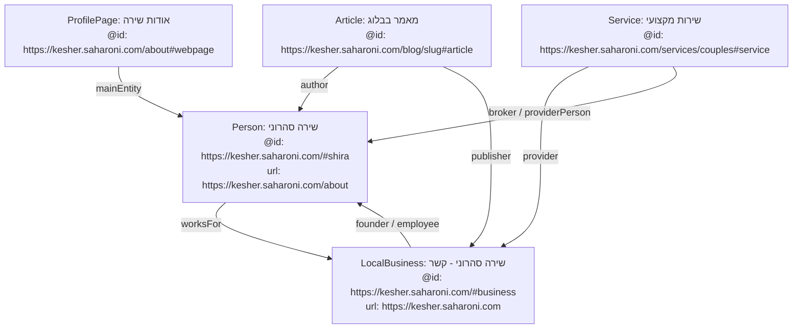

# מפת ישויות קנונית: שירה סהרוני והעסק קשר (Entity Map)

## 1. ביקורת מצב קיים: פיצול ישויות (Entity Fragmentation Audit)

באתר קיימים כיום מספר מופעים מנותקים של דמותה של שירה סהרוני והעסק, המייצרים אותות סותרים למנועי AI:

| עמוד | סוג ישות | `@id` קיים | ערך `url` | יחס עבודה/עסק |
|---|---|---|---|---|
| **דף הבית (`Home.tsx`)** | `Person` | `https://kesher.saharoni.com/#shira` | `https://kesher.saharoni.com/about` | `worksFor: #business` |
| **דף הבית (`Home.tsx`)** | `LocalBusiness` | `https://kesher.saharoni.com/#business` | `https://kesher.saharoni.com` | אינו מציין `founder` או `employee` |
| **דף אודות (`AboutPage.tsx`)** | `ProfilePage` | `https://kesher.saharoni.com/about` | `https://kesher.saharoni.com/about` | `mainEntity` הוא `Person` **ללא `@id`!** |
| **דפי מאמרים (`BlogPost.tsx`)** | `Article` | **חסר `@id`** | `.../blog/<id>` | `author` הוא `Person` אנונימי עם `url: .../` (דף הבית) |
| **דפי נחיתה אשדוד** | `LocalBusiness` | `...#service` | `.../couples-counseling-ashdod` | `provider: #business` (עסק בתוך עסק) |
| **עמודי שירות (`Services/*.tsx`)** | `Service` | חסר בחלקם | `.../services/<name>` | `provider: #business` (ללא קשר ל-`#shira`) |

**מסקנה חד-משמעית:** למרות שבדף הבית קיים המזהה הקנוני `/#shira`, שאר עמודי האתר אינם משתמשים בו אלא יוצרים ישויות מקומיות חדשות ואנונימיות. הדבר פוגע ביכולת של מנועי מענה (Knowledge Graph, Perplexity, SearchGPT) לייחס את המאמרים והשירותים לסמכות המקצועית של שירה.

---

## 2. הגדרת הישות הקנונית (Authoritative Entity Baseline)

על בסיס עובדות המאגר המאומתות בלבד (ללא המצאת תארים, הסמכות או פרופילים שאינם קיימים בקוד):

- **שם:** שירה סהרוני (Shira Saharoni)
- **תפקידים מאומתים במאגר:**
  - יועצת זוגית
  - מנחת הורים
  - מגשרת מוסמכת
  - עורכת דין בהכשרתה (ללא מתן שירותים משפטיים)
- **פרופילי רשת מאומתים (`sameAs` בלבד):**
  - Facebook: `https://facebook.com/shirasaharoni`
  - Instagram: `https://instagram.com/shira_saharoni`
- **עוגן קנוני של ישות האדם:**
  `https://kesher.saharoni.com/#shira`
- **כתובת פרופיל רשמית:**
  `https://kesher.saharoni.com/about`
- **עוגן קנוני של הישות העסקית:**
  `https://kesher.saharoni.com/#business`

---

## 3. ארכיטקטורת המידע המובנה המומלצת (Unified Entity Graph)

דיאגרמת יחסי הגומלין בגרף הסמנטי:



---

## 4. מפרט JSON-LD קנוני ליישום

### 4.1 ישות האדם הקנונית (`Person`)
מוטמעת בעמוד הבית ומשמשת כמקור אמת בדף האודות:

```json
{
  "@context": "https://schema.org",
  "@type": "Person",
  "@id": "https://kesher.saharoni.com/#shira",
  "name": "שירה סהרוני",
  "alternateName": "Shira Saharoni",
  "url": "https://kesher.saharoni.com/about",
  "image": "https://kesher.saharoni.com/images/shira-saharoni.webp",
  "jobTitle": [
    "יועצת זוגית",
    "מנחת הורים",
    "מגשרת מוסמכת"
  ],
  "worksFor": {
    "@type": "LocalBusiness",
    "@id": "https://kesher.saharoni.com/#business"
  },
  "sameAs": [
    "https://facebook.com/shirasaharoni",
    "https://instagram.com/shira_saharoni"
  ],
  "knowsAbout": [
    "ייעוץ זוגי",
    "הדרכת הורים",
    "גישור",
    "ילדים מחוננים",
    "הפרעת קשב וריכוז (ADHD)",
    "תפקודים ניהוליים",
    "משפחות עולים ותושבים חוזרים",
    "זוגיות בעלייה וברילוקיישן",
    "הכנה לנישואים והשנה הראשונה",
    "רווקות מאוחרת",
    "מציאת זוגיות"
  ]
}
```

### 4.2 ישות העסק הקנונית (`LocalBusiness`)
מוטמעת בעמוד הבית ובדפי שירות:

```json
{
  "@context": "https://schema.org",
  "@type": ["LocalBusiness", "ProfessionalService"],
  "@id": "https://kesher.saharoni.com/#business",
  "name": "שירה סהרוני — ייעוץ זוגי והנחיית הורים",
  "alternateName": "קשר — שירה סהרוני",
  "url": "https://kesher.saharoni.com",
  "telephone": "050-2763802",
  "founder": {
    "@type": "Person",
    "@id": "https://kesher.saharoni.com/#shira"
  },
  "address": {
    "@type": "PostalAddress",
    "addressLocality": "אשדוד",
    "addressCountry": "IL"
  },
  "areaServed": [
    {
      "@type": "City",
      "name": "אשדוד"
    },
    {
      "@type": "Country",
      "name": "ישראל"
    }
  ]
}
```

### 4.3 שיוך המחבר בכל מאמר (`BlogPost.tsx`)
בכל מאמר בלוג, שיוך המחבר והמו"ל יפנה ישירות לעוגנים הקנוניים:

```json
{
  "@type": "Article",
  "@id": "https://kesher.saharoni.com/blog/returning-to-israel-after-relocation-relationship#article",
  "headline": "חזרה לארץ אחרי רילוקיישן: כשהבית משתנה והזוגיות מחפשת עוגן",
  "author": {
    "@type": "Person",
    "@id": "https://kesher.saharoni.com/#shira",
    "name": "שירה סהרוני",
    "url": "https://kesher.saharoni.com/about"
  },
  "publisher": {
    "@type": "LocalBusiness",
    "@id": "https://kesher.saharoni.com/#business"
  }
}
```

---

## 5. שינויים מינימליים נדרשים בקוד (Implementation Delta)

1. **`src/pages/About/AboutPage.tsx`:**
   - הוספת `@id: `${SITE_CONFIG.url}/#shira`` לתוך אובייקט ה-`Person` ב-`mainEntity`.
2. **`src/pages/Blog/BlogPost.tsx`:**
   - שינוי אובייקט ה-`author` כך שיכיל `@id: `${SITE_CONFIG.url}/#shira`` ו-`url: `${SITE_CONFIG.url}/about``.
   - שינוי ה-`publisher` מ-`Organization` אנונימי להפניה לקנוני `@id: `${SITE_CONFIG.url}/#business``.
   - הוספת `@id` ספציפי למאמר (`.../blog/<canonicalRouteKey>#article`).
3. **`src/pages/Landing/CouplesCounselingAshdod/CouplesCounselingAshdodPage.tsx`:**
   - תיקון הישות המרכזית: מ-`LocalBusiness` עצמאי כפול ל-`Service` מקומי עם `provider: {"@id": `${SITE_CONFIG.url}/#business`}` ו-`areaServed: City "אשדוד"`.
4. **עמודי שירות (`src/pages/Services/**/*.tsx`):**
   - הוספת קישור `provider: {"@id": `${SITE_CONFIG.url}/#business`}` בכל עמודי השירות שבהם הוא חסר.
