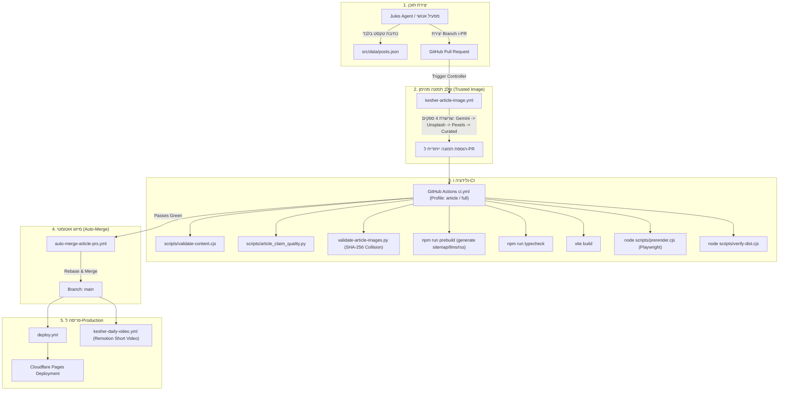

# מפת צינור הפרסום הקיים ונקודות הטמעה ל-AEO (Publishing Pipeline)

## 1. ארכיטקטורת הפרסום הנוכחית (End-to-End Flow)

תהליך הפרסום באתר **קשר** הוא תהליך אוטומטי היברידי הנשלט באמצעות GitHub Actions, סוכן Jules, ובקרים ייעודיים (Content Controllers).

### דיאגרמת זרימת פרסום קיימת (Mermaid)



---

## 2. פירוט שלבי הצינור הקיים

### 2.1 יצירת התוכן (Content Generation)
- **גורם יוצר:** סוכן Jules מונחה על ידי תבנית [`hebrew-article.md`](file:///Users/ninja/Documents/Kesher/.github/jules-templates/hebrew-article.md) או כותב אנושי.
- **מגבלות נוקשות:** Jules מייצר טקסט בלבד; נאסר עליו לייצר או למחזר תמונות, לבצע שינויים בקוד או לשנות מאמרים קיימים.
- **מיקום האחסון:** רשומה חדשה ב-`src/data/posts.json`.
- **שער פרסום בסיסי (Publication Gate):**
  - אורך מעל 500 מילים (`wordCount >= 500`).
  - לפחות 5 כותרות `<h3>` (`headingCount >= 5`).
  - מאמרים שאינם עומדים בתנאי זה נשארים טיוטות לא מאונדקסות.

### 2.2 הפקת נכסים מהימנה (Trusted Asset Pipeline)
- בקר התוכן מפעיל את `kesher-article-image.yml` שרץ מקוד `main`.
- מפיק תמונה ייחודית (נאכפת במניעת התנגשות SHA-256 כפולה).
- מבצע Commit של התמונה ל-PR.

### 2.3 בדיקות איכות ואימות (CI & Quality Gates)
- סקריפט `select-ci-profile.py` מזהה שינוי ממוקד במאמר ומפעיל פרופיל `article` חסכוני ומהיר.
- `scripts/validate-content.cjs` מוודא:
  - ייחודיות מזהה מאמר, כותרת ותמונה.
  - פורמט תאריך תקני `YYYY-MM-DD`.
  - תקינות אלט לתמונה (לפחות 20 תווים).
  - היעדר תביעות מוחלטות ואסורות (Claims Gate: למשל "מוסמכת", "הדרך היחידה", גישות אסורות ללא הכשרה).
  - היעדר ביטויים שבלוניים של AI ("גשר מעל התהום", "שריר של שיח" וכו').
  - מניעת כפילות נושאים מול 30 המאמרים האחרונים.
  - התאמה מושלמת בין `posts.json` ל-`postSummaries.json` ול-`sitemap.xml`.
- שלב הבנייה והרינדור (`prerender.cjs` ו-`verify-dist.cjs`) מוודאים תקינות HTML סופי.

### 2.4 פריסה וסינכרון מנועים
- לאחר מיזוג ל-`main`, ה-Workflow של `deploy.yml` בונה מחדש ופורס ל-Cloudflare Pages.
- `public/sitemap.xml`, `public/llms.txt`, `public/llms-full.txt` ו-`public/rss.xml` נפרסים יחד עם האתר ומעדכנים מידית את מנועי החיפוש ומנועי ה-AI.

---

## 3. נקודות הטמעה מומלצות לבקרת AEO (Extension Insertion Points)

**עיקרון מפתח:** הרחבת הצינור הקיים ולא הקמת מערכת פרסום מקבילה.

```
+-------------------------------------------------------------------------+
| [Insertion Point A] הנחיית כותב / סוכן (Prompt & Template Level)        |
| - הוספת דרישת BLUF (תשובה תמציתית של 40-60 מילים בפסקה ראשונה).         |
| - הגדרת שדה subcategory חובה מתוך רשימת קטגוריות סגורה.                |
+-------------------------------------------------------------------------+
                                    |
                                    v
+-------------------------------------------------------------------------+
| [Insertion Point B] אימות סטאטי ב-CI (validate-content.cjs & CI Gate)   |
| - בדיקת אחידות ישות שירה (מחבר חייב להישאר שירה סהרוני).               |
| - תקינות תאריך updatedAt (אם קיים - אסור שיהיה בעתיד או קודם ל-date).    |
| - אזהרה על היעדר שיוך אשכול (Topic Subcategory).                        |
| - וידוא קיום קישורים פנימיים למאמרים מדרג Tier-1.                      |
+-------------------------------------------------------------------------+
                                    |
                                    v
+-------------------------------------------------------------------------+
| [Insertion Point C] מחוללי נכסי AI (generate-llms-full.cjs & Schema)     |
| - הזרקת גרף ישות קנוני אחיד (Canonical Entity Graph) לכל דף מרונדר.      |
| - הרחבת llms-full.txt עם מבנה שאלות-תשובות וחלוקת פסקאות מודולרית.      |
+-------------------------------------------------------------------------+
```

1. **נקודה א' — תבניות יצירה (`hebrew-article.md`):**
   - הגדרת מבנה תשובה ממוקד (Answer Engine Optimized passage) בראש כל מאמר.
   - מניעת שחיקה של שאילתות קיימות על ידי בדיקת כפילות כוונת משתמש לפני כתיבה.
2. **נקודה ב' — בדיקות אימות (`validate-content.cjs`):**
   - הוספת בדיקות דטרמיניסטיות בלבד (נמדדות בקוד ולא ב-LLM).
   - בדיקת עקביות תאריך `updatedAt` מול `date`.
   - סיווג בדיקות ל-`ERROR` (חוסם בנייה) ו-`WARNING` (אינו חוסם).
3. **נקודה ג' — הפקת קובצי מטא ומסמכי LLM:**
   - הפקת `dateModified` אמיתי ב-`sitemap.xml` רק כאשר קיים שדה `updatedAt`.
   - הבטחת נוכחות ה-Canonical Entity ב-JSON-LD של כל מאמר.
