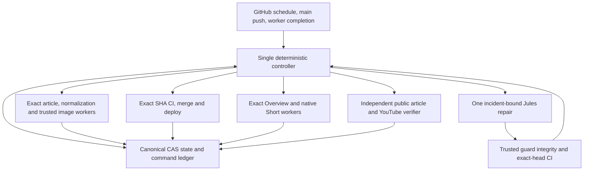

# Autonomous KESHER operating architecture

Status: implementation specification. This document is not evidence that migration or autonomy is complete.

## Decision and evidence

Use one deterministic controller for scheduling, reconciliation and escalation, one canonical operational state document, and exact-command workers. Retain mature article/media processing functions and their proven guards; retire the stacked controller entrypoints and independently mutating repair workflows after migration tests pass.

Continuing to patch the V3/V4/V5/stabilized inheritance chain preserves the dispatch-before-save and competing state problems. Replacing all media processing would discard proven auth, render and upload safeguards. Consolidating orchestration while adapting the workers addresses the observed failure boundaries without inventing another provider pipeline.

PROVEN baseline problems:

- `GitHubClient.save_controller_state` reads a fresh blob SHA while saving an old in-memory state, then repeats on conflict. It can overwrite another writer's decisions. `request` retries POST on uncertain network failures. `StabilizedRuntimeV5Controller._dispatch_exact_rejected_rebuild` dispatches before persisting its attempt.
- `RuntimeV5Controller._backlog_media_preflight` selects an exact source but resumes its Overview using only `operation=full`; Short backlog generation stops at `generate`. These lose the intended identity or terminal boundary.
- `GitHubApi.find_dispatched_run` adopts by creation time. `active_external_media_run` is global. A different source can therefore supply apparent acknowledgement/wait evidence.
- `V5GitHubClient.article_session_snapshot` hashes `updateTime`. Poll/timestamp changes can appear as semantic progress.
- Baseline durable state records the same Overview as verified and exhausted. Supervisor state contains a `human_blocker` at strike 55, despite the nominal three-stage ladder.
- PR #812 temporarily disabled an Axe rule. Its final merged diff hides the bypass; PR #646 retained an image locator that can pass on a poster instead of the article hero. Green checks need a trusted evaluator.

Sources: baseline main `55563f42`, indexed PRs #440–#485, #667/#670/#680/#703/#708/#709/#716/#718/#823–#833/#849–#865; `live-evidence-manifest.json`; detailed incident adjudications. Historical claims remain distinct from independently reproduced behavior.

## Ownership and topology

The controller owns every stage transition and recovery decision. Workers claim and report only their assigned command. CI validates; deploy publishes the validated SHA; the verifier observes remote products. Jules writes articles and repairs novel code defects; it does not schedule, determine public completion, or authorize changing its own guards. ChatGPT has no runtime dependency.

## Identity and state

Canonical state lives on `automation-state` at `.kesher-controller/state.json`, with an explicit new schema and monotonically increasing revision. A load returns the exact Git blob SHA; a save uses that observed SHA. A conflict ends that tick without external mutation. Never reread a newer SHA to force an old snapshot through.

A publication slot is an Israel calendar date. It has one adopted article PR/source. An immutable media identity contains `slot`, canonical `slug`, full `content_sha256`, and explicit kind `overview` or `short`. Source content hashing remains compatible with the canonical article-body contract during migration. A source edit creates a new identity; old work remains auditable and cannot satisfy or spend the new identity's budget. Exact identity is mandatory for every operation; partial selectors fail closed. Pipeline-version names are provenance, not product identity.

State contains:

- `schema_version`, `revision`, `slots`, immutable source bindings, and active source per slot;
- article PR/head/merge SHA, deploy SHA and independently verified public evidence;
- media kind, provider/source/artifact IDs, file hashes, render provenance, YouTube ID and remote verification;
- deterministic command ledger with claim owner, expected identity, code revision, attempts and receipts;
- incident ledger with stable failure signature, semantic progress, bounded action history, Jules session/PR/CI/merge links and next action;
- migration provenance and quarantined ambiguous evidence.

Artifact archives are immutable evidence/storage, not an alternative authoritative mutable state. Workers project only their exact media item from canonical state into local processing; durable checkpoints merge back through CAS. No newest-global artifact restores over canonical state. Auth material stays outside operational JSON and current secrets take precedence over stale encrypted recovery material.

## Command protocol and crash behavior

1. Observe current main, canonical state, exact existing PR/jobs/provider artifacts/uploads and public evidence.
2. Select an eligible action; derive its ID from immutable identity, operation and budget ordinal.
3. Persist `REQUESTED` intent with the observed CAS revision before dispatching.
4. Dispatch once. An ambiguous response remains pending reconciliation; do not blindly retry a mutation.
5. A worker CAS-claims that command as `ACCEPTED`, recording its exact workflow run and attempt. Duplicate, stale-source, wrong-kind and obsolete-code claims do no work.
6. Checkpoint provider/request IDs and upload session before subsequent work. Resume exact existing work after a crash. An uncertain external creation first queries the provider or upload session; uncertainty never authorizes a fresh insert.
7. Persist immutable output/validation/upload receipts. A worker's successful process exit is not a product transition.
8. Independently fetch remote publication state. Only matching public evidence permits `PUBLICLY_VERIFIED`.

Lifecycle distinguishes `REQUESTED`, `ACCEPTED`, `STARTED`, `MEANINGFUL_PROGRESS`, `OUTPUT_CREATED`, `TECHNICALLY_VALIDATED`, `UPLOAD_STARTED`, `UPLOADED`, `PROCESSED`, `PUBLISHED`, `PUBLICLY_VERIFIED`. Failure/wait classification is separate from progress. An acknowledgement cannot jump directly to public completion. A lost local write cannot erase a previously persisted provider/upload binding.

## Scheduling and recovery

One controller concurrency group serializes ordinary ticks; CAS also protects against manual/concurrent invocations. Worker concurrency plus command claims protects their side effects. A command receipt, not a nearest timestamp, identifies a dispatched run. Reruns execute current trusted code and reconcile the original command/source; stale input never switches to today's source.

Current eligible publication work has priority. Waiting external processing, backoff, or a blocked current identity permits one eligible historical action, so backlog cannot block today and today cannot indefinitely prevent historical reconciliation. Exact-target operations never consult global FIFO. Exhausted rows remain visible and enter incident repair; they do not monopolize the queue.

Known classes map to bounded deterministic actions: transient API/network/rate-limit backoff; provider pending/timeout reconciliation; exact download/render repair; metadata-only repair without generation/upload; CI/deploy recovery at exact SHA; state/cache/provenance quarantine and exact reconciliation. Budgets belong to identity + action + failure class and include the initial attempt. Polls, timestamps, workflow reruns and identical Jules replies do not reset budgets. Actual advancing provider/output/PR/commit/public evidence does.

Software defects create/reuse one stable incident and Jules repair chain. Jules stalls have a semantic activity deadline, bounded continuation and terminal-session reconciliation; no endless replacement sessions or duplicate PRs. Exhausted software repair stays a visible circuit-broken incident with automatic reconciliation/probes while other work proceeds. It is not mislabeled as a user authentication problem. Only demonstrably external interactive auth, required external permission or payment enters `EXTERNAL_HUMAN_ACTION_REQUIRED`; no attempts are consumed until the relevant preflight changes.

## Public delivery and current product contracts

- Article: exact adopted source is in main; successful deployment contains that merge/source revision; public canonical URL, content digest marker, title, metadata and approved local hero bytes match. A 200/title alone is insufficient. URL transport percent-encodes Hebrew safely without changing canonical identity.
- Overview: exact provider/source/artifact, file and render provenance; approved ending signature inside the source timeline; preserved audio; exactly one adopted upload on the configured channel; remote processing succeeded, public visibility, correct full title/description and complete article plus standalone site URLs.
- Short: independent native NotebookLM Short first; complete source duration, no obsolete 55-second cap; exact portrait media and provenance; no Overview source/task/raw-file reuse hidden behind a `direct-short` label. The approved final independent landscape fallback is available only at its documented attempt boundary, never by reusing the Overview. Female voice is preferred with the approved bounded male fallback. Neither old voice nor old appended-outro rules may cause endless regeneration.
- Signature: final approximately 2–3 seconds inside the existing timeline, preserving underlying audio and duration. Later approved background may cover pixels; an old `signature_fullscreen=true` flag alone does not prove this contract.
- Optional enhancement assets may fall back to source-only visuals. Required provenance, technical validity, signature and public metadata remain blocking.
- A+B+C completion is derived from matching independent public evidence for all three, with freshness and verifier contract version. URLs or local booleans alone cannot close the cycle or incident.

## Jules and trusted validation

Every repair packet carries incident/source/kind/failure, observed and expected state, exact run/artifact/log references, reproduction, historical regression links and forbidden shortcuts. Require root cause or explicit UNKNOWN; no unrelated refactor, evaluator weakening, duplicate repair, or silent product-policy change. Track session → branch → PR → commit → CI → merge → exact interrupted identity → public verification.

Automerge requires current-head CI plus a guard-integrity check executed from trusted base code. Existing validation/tests/CI/identity/public guards cannot be weakened by the repair PR. Additive regression tests are encouraged. A legitimate obsolete requirement change requires an existing authorized contract migration and explicit evidence; a PR cannot authorize its own exception. Test mutation checks supplement, rather than replace, running trusted regression gates against the candidate code.

## Migration and retirement

Migration is pure/read-only until its report passes: import V5 state, supervisor incidents and every retained exact media snapshot; bind source and kind explicitly; preserve IDs/attempt histories; deduplicate identical observations; quarantine conflicting providers/uploads rather than pick newest. Re-fetch remote public state before adopting completion. Snapshot hashes and old blob SHA remain in the audit record.

Cutover uses the same canonical state branch/path, a schema fence, exact observed CAS revision and serialized controller. Workers in flight are adopted through explicit legacy import receipts or allowed to finish before replacement. Disable obsolete schedules and one-off mutating workflows, remove their entrypoints, and verify both main definitions and GitHub workflow activation state. Old diagnostic/shadow tools must be read-only. Preserve historical safeguards as current tests before deleting their implementation.

## Required proof before completion

The historical regression matrix must map every significant family to an invariant, test and recovery behavior. Fault tests cover API 401/403/429/500, network/timeout, pending provider, lost dispatch response, crash before/after state write, concurrent CAS, duplicate invocation, wrong source/kind, stale auth/cache/artifact/upload, Jules stall/guard edits and false-green completion. Test actual adapters and workflows as well as pure state functions.

Require complete local gates, exact-head GitHub CI, an adversarial review, migration replay against captured durable evidence, safe merge if branch policy permits, and read-only post-merge reconciliation/public evidence. No real provider generation merely to exercise recovery. Completion remains unproven until every requested deliverable and invariant has current evidence.
